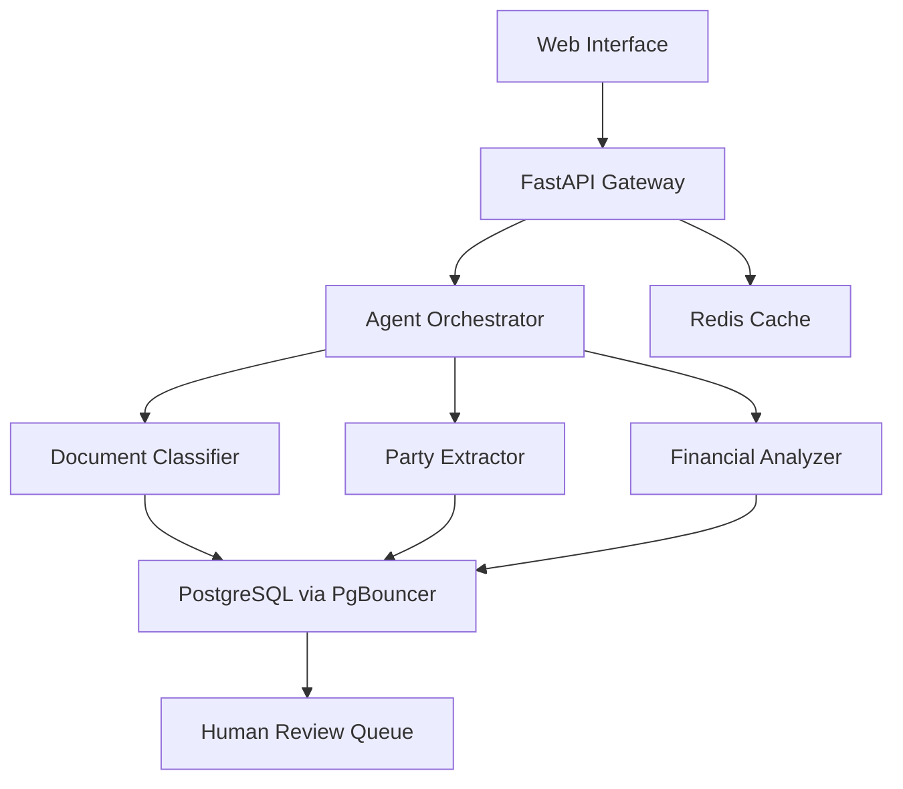

# System Overview

## 🎯 Vision & Mission

The Agent Orchestration System is designed to solve enterprise contract analysis challenges through:

- **Automated Intelligence** - AI agents handle 80%+ of routine contract processing
- **Human Oversight** - Critical decisions and high-value contracts require human validation
- **Enterprise Reliability** - Built for environments where errors could cost millions
- **Scalable Architecture** - Handle increasing document volumes without performance degradation

## 🏗️ Architecture Principles

### 1. Database-First Design
**Problem Solved:** SQLite file locking caused sequential processing and frequent timeouts.

**Solution:** PostgreSQL with PgBouncer connection pooling enables true concurrent operations.

```
Before: Agent A → SQLite (LOCKED) ← Agent B (WAITING) ← Agent C (WAITING)
After:  Agent A → PostgreSQL ← Agent B ← Agent C (ALL CONCURRENT)
```

### 2. Agent Orchestration
**Problem Solved:** Single-threaded document processing was slow and unreliable.

**Solution:** CrewAI-based agent orchestration with specialized roles.

```
┌─────────────────────────────────────────────────────────────┐
│                     Document Input                          │
└─────────────────┬───────────────────────────────────────────┘
                  │
                  ▼
┌─────────────────────────────────────────────────────────────┐
│              Parallel Agent Processing                      │
│  ┌─────────────┐  ┌─────────────┐  ┌─────────────┐         │
│  │Document     │  │Party        │  │Financial    │         │
│  │Classifier   │  │Extractor    │  │Analyzer     │         │
│  └─────────────┘  └─────────────┘  └─────────────┘         │
└─────────────┬───────────┬───────────┬───────────────────────┘
              │           │           │
              ▼           ▼           ▼
┌─────────────────────────────────────────────────────────────┐
│                 Validation & Orchestration                  │
│  • Cross-reference agent results                           │
│  • Apply business rules                                     │
│  • Calculate confidence scores                              │
│  • Flag for human review if needed                         │
└─────────────────┬───────────────────────────────────────────┘
                  │
                  ▼
┌─────────────────────────────────────────────────────────────┐
│                  Database Storage                           │
│  • Structured metadata                                     │
│  • Audit trails                                            │
│  • Performance metrics                                     │
└─────────────────────────────────────────────────────────────┘
```

### 3. Enterprise Security & Reliability

**Multi-Layer Validation:**
- **Agent Cross-Validation** - Multiple agents validate each other's results
- **Confidence Scoring** - Each extraction has quantified reliability metrics
- **Business Rules** - Automatic flagging based on contract value, terms, parties
- **Human Review Queue** - Critical documents routed to human experts

**Audit & Compliance:**
- **Complete Processing History** - Every agent action logged with timestamps
- **Performance Metrics** - Agent success rates, processing times, confidence trends
- **Error Recovery** - Automatic retry with exponential backoff
- **Data Integrity** - ACID transactions ensure consistent state

## 🔧 Component Architecture

### Core Components

| Component | Purpose | Technology | Status |
|-----------|---------|------------|--------|
| **PostgreSQL Database** | Primary data store with concurrency | PostgreSQL 15 + PgBouncer | ✅ Production |
| **Agent Orchestrator** | Coordinates parallel agent execution | CrewAI + FastAPI | 🔄 Building |
| **Document Classifier** | AI document type detection | Gemini 2.5 Flash | ✅ Implemented |
| **Party Extractor** | Company/individual identification | CrewAI + Regex fallback | ✅ Implemented |
| **Financial Analyzer** | Contract value and payment extraction | CrewAI + Pattern matching | ✅ Implemented |
| **Web Interface** | User upload and review interface | HTML5 + JavaScript | ✅ Working |
| **Redis Cache** | Session and task caching | Redis 7 | ✅ Running |

### Integration Points



## 📊 Performance Characteristics

### Scalability Targets

| Metric | Current | Target | Notes |
|--------|---------|--------|-------|
| **Documents/Hour** | ~60 | 500+ | With full agent orchestration |
| **Concurrent Users** | 10 | 100+ | PostgreSQL connection limit |
| **Average Processing Time** | 60s | 30s | Parallel agent optimization |
| **Accuracy Rate** | 75% | 90%+ | With agent cross-validation |

### Resource Requirements

**Minimum Configuration:**
- **CPU**: 4 cores (agent parallel processing)
- **RAM**: 8GB (PostgreSQL + agents + embeddings)
- **Storage**: 50GB (document content + metadata + logs)
- **Network**: Stable internet (Google AI API calls)

**Production Configuration:**
- **CPU**: 8+ cores (higher agent concurrency)
- **RAM**: 16GB+ (larger connection pools)
- **Storage**: 200GB+ (enterprise document volumes)
- **Network**: Redundant connections (reliability)

## 🎯 Business Value Proposition

### Cost Savings
- **Labor Reduction**: 80% reduction in manual contract review time
- **Error Prevention**: Automated flagging prevents costly oversights  
- **Compliance**: Consistent processing reduces legal risk
- **Scalability**: Handle 10x document volume without proportional staff increase

### Operational Benefits
- **Speed**: Process contracts in minutes vs. hours/days
- **Consistency**: Standardized analysis criteria across all documents
- **Auditability**: Complete processing history for compliance
- **Integration**: API-first design enables workflow automation

### Strategic Advantages
- **SaaS Ready**: Multi-tenant architecture foundation
- **Enterprise Security**: Human-in-loop for critical decisions
- **Extensible**: Plugin architecture for new document types
- **Future-Proof**: Container-based deployment, cloud-ready

---

**Next:** [Current Implementation Status →](./02-current-implementation.md)