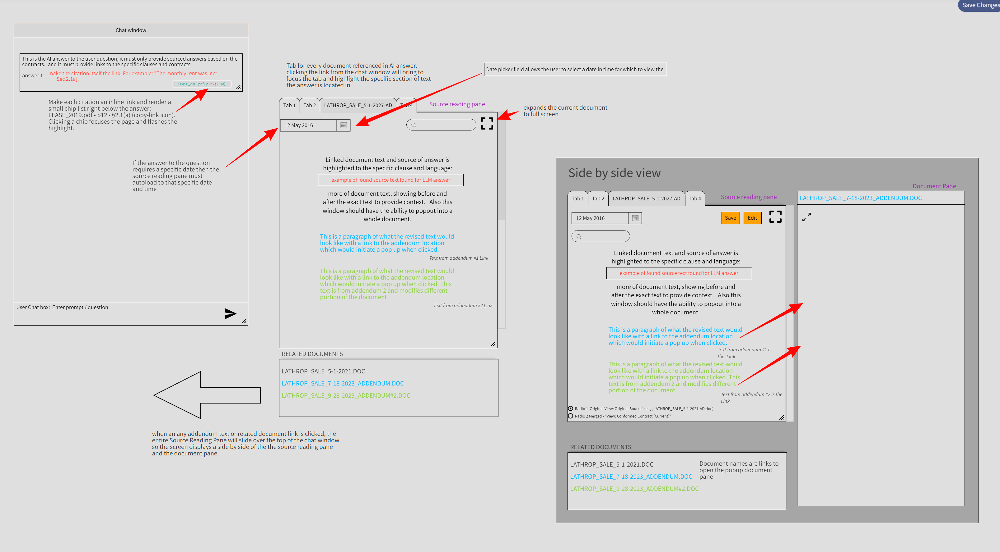

# Contract Evidence UI — Build Instructions (v2.1.0)

**Owner:** Scott

**Purpose:** Lawyer-grade, time-aware contract answers with receipts.

**Golden rule:** **No provenance → no answer.**

**Scope:** Chat, Source Reading Pane (tabs), Side-by-Side (SxS), As-Of control, “Show Your Work” for calculations, HIL Editor, separate OCR Intake.

**Change summary (v2.1.0):**

- Chips **no longer open files** by default; they **route inside the Source Reading Pane** and flash the bbox/cell.
- **Shift+Click** a chip → **SxS** (Conformed@As-Of left, source document right).
- **Ctrl/Cmd+Click** a chip → open deep link in a new browser tab.
- New **Expand (Full View)** button in the Source Reading Pane header acts on the **active tab** (Conformed or Document).
- Added shortcuts (`F` to toggle Full View, `Esc` to close), telemetry for Full View, and A11y details.

---

## 0) Goals

- Every answer is **verifiable**: click → open exact page, **highlight** the exact span or **table cell**.
- Time-aware: show **Conformed** agreement **as-of** a date (amendment overwrites; silence carries).
- Any calculation **shows its work** with links to **each operand’s** sources.
- HIL review exists but stays out of the user’s way.

---

## 1) Layout (3 areas)

- **Chat Window (left):** conversation + answers.
- **Source Reading Pane (center):** tabs for all referenced docs; page canvas + overlay highlights; **As-Of** date.
- **Side-by-Side** (full-width overlay): left = **Conformed (as-of)**; right = **Source Document** *or* **Delta** view.

*All panes are resizable; SxS floats over chat.*

---

## 2) Answer Composition & Evidence Chips

- In the answer text, the **citation itself is the link** (e.g., “…as per [§2.1(a)]”).
- **Evidence chips** render directly beneath each answer (minimal text):
    - `Lease 2019 • p12 • §2.1(a)`
    - `Amend. 1 • p3 • r3c2`

### Chip behavior (definitive)

- **Click:** Focus the correct tab in the **Source Reading Pane**, scroll to the bbox/cell, **flash highlight**.
- **Shift+Click:** Open **SxS** (left = Conformed@As-Of, right = that source doc).
- **Ctrl/Cmd+Click:** Open the **deep link in a new browser tab** (standalone).
- **Right-click / “⋯” menu:** Copy Deep Link • Send to Review • Open full PDF/Download (role-gated).

**Deep link format**

```
/doc/{sha256}?page=12&bbox=126,532,419,557&field=base_rent&asof=2020-10-01&exp=1734390000&sig=<hmac>

```

> bbox is x0,y0,x1,y1 in PDF user-space (origin bottom-left), comma-separated integers after rounding.
> 

---

## 3) Source Reading Pane (Tabs + As-Of)

- **Tabs:** one per referenced document. Opening an answer **auto-opens** cited docs as tabs and focuses the first evidence span.
- **As-Of date picker** (pane header): defaults to the query’s date if present, else **today**.
    - Conformed recomputes for that date; timeline chips: `Original → A1 → A2 → …` (click sets As-Of to the instrument effective date).
    - **Display timezone:** *America/Los_Angeles*.
- **Viewer controls:** Zoom to selection • Toggle text layer • Darken page • Open full PDF • Copy page link • Find-in-doc • Prev/Next Evidence.

**Conformed tab is always present and labeled** `Conformed (As-Of YYYY-MM-DD, America/Los_Angeles)`.

---

## 4) Full View (Expand) — In-pane popout

- **Expand** button in the Source Reading Pane header (upper-right) acts on the **active tab**:
    - If **Conformed** active → open **Full Conformed** overlay (keeps As-Of picker visible).
    - If a **Document** tab active → open **Full Document** overlay (optionally show page thumbnails).
- **Shortcuts:**
    - `F` → toggle Expand for current tab
    - `Esc` → close overlay
- **Telemetry:** `fullview_opened {tab:"conformed"|"document", as_of?, sha256?}`; `fullview_closed {tab,...}`
- **A11y:** `aria-pressed` reflects state; `aria-controls="#fullViewOverlay"`; trap focus in overlay; restore focus to invoking chip/tab on close.
- **Optional deep link:** `&view=full` opens overlay directly.

---

## 5) Side-by-Side (SxS) — Provenance & Diffs

**Pane types**

- **Conformed** — shows contract **as-of** a date; **has date picker** in that pane.
- **Source Document** — shows a specific PDF (lease/amendment/exhibit); **no date picker** (immutable).

**Patterns**

- Conformed@T1 ↔ Conformed@T2 (time-travel)
- Conformed@T ↔ Source Amendment (default provenance)
- Conformed@today ↔ Original Lease PDF

**Behavior**

- **Sync scroll** on; if both Conformed, sync by clause; if right is a doc, center on that doc’s evidence span.
- Clicking a revised clause on the left jumps the right pane to the **authorizing span**.

**Actions:** **Edit** (HIL), **Save** (audit), **Compare to…** (pick date/instrument for right pane).

---

## 6) Calculation Transparency Rule (CTR)

If an answer includes a derived number from **≥ 2 sources** (even within the same doc), the UI **must show the work**:

- **Breakdown card** under the answer (always visible):
    
    `Total (Oct 2020) = Base Rent + CAM + Taxes − Credits`
    
    Each line shows the amount **and its chip(s)** with a ✓/⚠/blocked badge.
    
- **Formula trace** (inline):
    
    `= 10000.00 + 4231.17 + 1111.00 − 0.00 = 15342.17` **✓ Verified**
    
- Every operand links to **its exact span/cell** (tables include row/col).
- **Gate:** If any operand lacks verifiable evidence or fails validation, **do not display** the total. Render:
    
    **Blocked:** `<operand>` evidence missing/invalid. **Send to Review →**
    

---

## 7) Tables & Optional Drawer

- Table evidence → open the correct doc tab and highlight the **cell** (e.g., r3c2).
- *(Optional)* **Evidence Drawer** icon on a table chip opens a lightweight grid (extracted CSV), highlights the source cell, and shows checksum (✅/⚠️). “Open in Document” jumps to the tab.
- Tabs remain primary; drawer is a speed boost only.

---

## 8) HIL (Human-in-the-Loop) Editing

- **HIL runs in SxS.** Click **Edit** to enable **structured** edits on the Conformed pane:
    - **Accept** • **Correct (enter value)** • **Upload better scan** • **Ignore (boilerplate)**
    - Saving creates a **ClauseVersion** or **human extraction** with provenance and **audit log** (user, time, reason).
    - Free-text overrides are watermarked **Manual Override** and require a reason.
- HIL corrections **re-run validator** and update Conformed + Answers immediately.

---

## 9) OCR / Intake (Separate Page)

- **Document Intake** prior to analysis:
    - Queue with statuses (Needs OCR, Needs Review, Ready).
    - Per-page viewer with **low-confidence heatmap**.
    - Actions: **Transcribe / Upload better scan / Ignore**.
    - Quality metrics (dpi, skew, contrast).
    - **Promote to Analysis** only after validator passes.

---

## 10) Validation & Gating (must pass before display)

- **Arithmetic:** evaluate expression tree using **decimal**; round only at display.
- **Units:** normalize currencies/units; no mixing without explicit conversion evidence.
- **Tables:** verify cell exists; optional totals reconcile → badge ✅/⚠️.
- **Temporal:** As-Of resolver picks correct ClauseVersion; overlaps ⇒ conflict ⇒ HIL.
- **Provenance:** every field has `sha256`, `page`, `bbox` (or `cell`), `snippet`, `extractor`, `confidence`.

> No provenance → no answer.
> 

---

## 11) Data Contracts (Frontend expects)

**Answer payload**

```json
{
  "as_of": "2020-10-01",
  "answer": "Total rent (Oct 2020): $15,342.17",
  "breakdown": [
    {
      "label": "Base Rent",
      "amount": 10000.00,
      "evidence": [
        {
          "doc": "LEASE_2019.pdf",
          "sha256": "…",
          "page": 12,
          "section": "§2.1(a)",
          "bbox": [100, 520, 420, 560]
        }
      ],
      "status": "verified"
    },
    {
      "label": "CAM",
      "amount": 4231.17,
      "evidence": [
        {
          "doc": "AMEND_1.pdf",
          "sha256": "…",
          "page": 3,
          "table": { "row": 3, "col": 2, "title": "CAM Schedule" },
          "bbox": [210, 320, 280, 340]
        }
      ],
      "status": "verified"
    },
    {
      "label": "Taxes",
      "amount": 1111.00,
      "evidence": [
        {
          "doc": "LEASE_2019.pdf",
          "sha256": "…",
          "page": 18,
          "section": "Exhibit B",
          "bbox": [140, 200, 390, 230]
        }
      ],
      "status": "verified"
    }
  ],
  "formula": "total = base_rent + cam + taxes - credits",
  "tabs_to_open": ["LEASE_2019.pdf", "AMEND_1.pdf"],
  "schema_version": "2.0.0"
}

```

**Evidence chip**

```json
{
  "display_doc": "Lease 2019",
  "sha256": "…",
  "page": 12,
  "section": "§2.1(a)",
  "span_ids": ["s1", "s2"],
  "deep_link": "/doc/{sha256}?page=12&bbox=100,520,420,560&asof=2020-10-01&exp=1734390000&sig=<hmac>",
  "status": "verified",
  "confidence": 0.93,
  "schema_version": "2.0.0"
}

```

**SxS state**

```json
{
  "left":  { "type": "conformed", "as_of": "2020-10-01", "focus": { "clause_key": "lease.base_rent" } },
  "right": { "type": "document",  "sha256": "…AMEND1…", "focus": { "page": 3, "bbox": [210, 320, 280, 340] } }
}

```

---

## 12) Keyboard & A11y

- Evidence nav: `[` / `]` = prev/next evidence • `Enter` = open/focus • `Shift+Enter` = open SxS.
- **Full View:** `F` toggle, `Esc` close.
- **New tab:** **Ctrl/Cmd+Click** a chip.
- Color-blind-safe highlight palette; optional hatched overlays.
- All chips and controls are keyboard reachable (ARIA roles/labels); chip aria-label example:
    
    `aria-label="Evidence: Lease 2019, page 12, section 2.1(a)"`.
    

---

## 13) Telemetry & Audit

- Log: `answer_rendered`, `chip_clicked`, `sxs_opened`, `asof_changed`, `deep_link_copied`, `hil_action`, `fullview_opened`, `fullview_closed`.
- Show **SHA-256** and source system **in the Source Pane header** (not on chips).

---

## 14) Non-Functional

- Pre-render thumbnails & page PNGs; cache by `sha256`.
- PDF.js + overlay canvas; store bboxes in **PDF user space**; transform via viewport (handles rotation).
- Lazy-load heavy features (SxS, history, optional drawer).

---

## 15) Acceptance Criteria (MVP+)

- Clicking any **chip** opens the **correct tab** and **flashes** the exact span/cell (no navigation away).
- **Shift+Click** of a chip opens **SxS** with Conformed (As-Of) vs Source (no date picker).
- **Ctrl/Cmd+Click** opens the deep-linked view in a **new browser tab**.
- **Expand** toggles a full-screen overlay for the **active tab**; `F` toggles; `Esc` closes; highlight preserved.
- Changing **As-Of** re-resolves Conformed content, highlights, and math; source tabs persist.
- Derived numbers display **breakdown + formula** with chips and per-operand badges; validator ✓ before display.
- Missing/invalid evidence **blocks** the answer and creates a Review task.

---

## 16) Version Control & Change Management

### 16.1 Spec & UI Versioning

- This document: **v2.1.0** (UI interaction changes; no API schema changes).
- Use **SemVer**: **MAJOR.MINOR.PATCH**.
- Payloads carry `schema_version`; unchanged at **2.0.0** in this release.

### 16.2 Git Branching & Releases

- `main` (stable), `develop` (active), `feature/*`, `release/x.y.0`, `hotfix/x.y.z`.
- Include **PR template**, **CHANGELOG.md**, **CODEOWNERS**.

### 16.3 API & Schema Compatibility

- Frontend supports current and previous **minor** `schema_version`.
- Feature flags: `feature.tableDrawer`, `feature.deltaCompare`, `feature.deepLinks` (on by default), `feature.fullView` (on).

### 16.4 Migrations & Rollouts

- UI behavior switches are behind flags where risky.
- CI contract tests: payload → render → chip click → focus & highlight.

---

## 17) Testing

### 17.1 Scenarios (happy path)

- Single-doc span; multi-doc multi-span; table cell origin with checksum.
- As-Of set via date picker and via timeline chips; chips still resolve.
- Full View toggled on both Conformed and Document tabs.

### 17.2 Edge cases

- Amendment silent on a clause (carry-forward).
- Overlapping ClauseVersions (conflict → HIL).
- Proration (mid-month start): expression tree shows factors & sources.
- No span found for an operand (Blocked UI state).
- Deep link expires or fails signature → rejected gracefully.

### 17.3 Performance

- Open answer citing 3 docs: tabs appear < 300ms (from cache).
- SxS open < 500ms on cached pages.
- Rendering highlights on rotated pages is correct.

---

## 18) Routing & Deep-Link Parsing

**Chip target model**

```json
{
  "target": "conformed" | "document",
  "as_of": "YYYY-MM-DD",
  "sha256": "…",             // required for target=document
  "page": 12,
  "bbox": [126, 532, 419, 557],
  "cell": { "row": 3, "col": 2 } // when table-derived
}

```

**Deep link URL**

```
/doc/{sha256}?page=12&bbox=126,532,419,557&field=base_rent&asof=2020-10-01&exp=1734390000&sig=<hmac>[&view=full]

```

**Router rules**

- If `asof` present → focus **Conformed** tab at that date; also open the cited **source doc** tab(s).
- If `sha256` present → open **Document** tab and scroll highlight to `bbox`.
- **Shift+Click** → SxS (left Conformed@as-of, right Document@sha256).
- **Ctrl/Cmd+Click** → allow browser to open a new tab with the deep link.

---

## 19) Highlight Rendering Spec

- Store bboxes in **PDF user space** (origin bottom-left).
- Use PDF.js `page.getViewport({ scale })` and `Util.applyTransform` to map to screen.
- **Rotation:** do not pre-rotate bboxes; let the viewport handle it.
- **Multi-span:** draw N rectangles per evidence; one tint per field.
- **Focus flash:** animate alpha 0→0.35→0.15 over 600ms.
- **Find-in-doc:** dashed boxes (distinct from solid evidence tint).

---

## 20) Security & Access (MVP baseline)

- **Auth & RBAC**; Postgres **RLS** by `tenant_id`.
- **Signed preview URLs** with TTL (`user_id`, `tenant_id`, `sha256`, `exp`, HMAC).
- Serve previews via proxy; originals downloadable only for authorized roles.
- **Audit log** events (see §22) include `user_id`, `sha256`, `page`, `field`.

---

## 21) Error & Empty States

- **Blocked calculation:**
    
    `Blocked: <operand> evidence missing/invalid.` **Send to Review →**
    
- **Doc not found / access denied:** toast + stay in current tab; chip shows disabled state.
- **No highlight match:** yellow banner “Span out of bounds; opening page start” and scroll to top.
- **As-Of no conformed value:** gray panel “No active version at this date.” + history chips.

---

## 22) Event Telemetry (names & payloads)

- `answer_rendered` `{answer_id, as_of, doc_count}`
- `chip_clicked` `{sha256, page, field, as_of, with_shift}`
- `sxs_opened` `{left_type, left_as_of, right_type, sha256?}`
- `asof_changed` `{from?, to}`
- `deep_link_copied` `{sha256, page, field}`
- `hil_action` `{action: accept|correct|upload|ignore, field, sha256, page}`
- `fullview_opened` `{tab: 'conformed'|'document', as_of?, sha256?}`
- `fullview_closed` `{tab?}`

---

## 23) Test Hooks & Smoke Tests

**`data-testid`s**

`answer-citation`, `evidence-chip`, `asof-date`, `timeline-chip`, `tab-conformed`, `tab-document`, `highlight-span`, `open-sxs`, `prev-evidence`, `next-evidence`, `breakdown-row`, `fullview-toggle`, `fullview-close`.

**Playwright smoke (outline)**

```tsx
test('chip routes to tab and highlights span', async ({ page }) => {
  await page.getByTestId('evidence-chip').filter({ hasText: 'Lease 2019 • p12' }).first().click();
  await expect(page.getByTestId('tab-document')).toContainText('LEASE_2019.pdf');
  await expect(page.getByTestId('highlight-span')).toBeVisible();
});

test('shift+click opens SxS with correct pane types', async ({ page }) => {
  await page.getByTestId('evidence-chip').filter({ hasText: 'Amend. 1' }).first().click({ modifiers: ['Shift'] });
  await expect(page.getByTestId('open-sxs')).toBeVisible();
});

test('full view toggles and preserves context', async ({ page }) => {
  await page.getByTestId('fullview-toggle').click();
  await expect(page.getByTestId('fullview-close')).toBeVisible();
  await page.keyboard.press('Escape');
  await expect(page.getByTestId('fullview-close')).not.toBeVisible();
});

```

---

## 24) Interfaces (optional, for typed projects)

```tsx
export type PaneType = 'conformed' | 'document';

export interface EvidenceRef {
  doc: string;
  sha256: string;
  page: number;
  bbox: [number, number, number, number];
  section?: string;
  table?: { row: number; col: number; title?: string };
}

export interface BreakdownItem {
  label: string;
  amount: number;
  evidence: EvidenceRef[];
  status?: 'verified' | 'warn' | 'blocked';
}

export interface AnswerPayload {
  as_of: string;
  answer: string;
  breakdown: BreakdownItem[];
  formula: string;
  tabs_to_open: string[];
  schema_version: string; // "2.0.0"
}

export type ConformedPane = { type: 'conformed'; as_of: string; focus?: { clause_key?: string } };
export type DocumentPane  = { type: 'document' ; sha256: string;  focus?: { page?: number; bbox?: [number, number, number, number] } };

export interface SxSState {
  left:  ConformedPane;
  right: DocumentPane | ConformedPane;
}

```

---

## 25) Minimal Backend Endpoints (UI Contracts)

- `GET /answers/:id` → `AnswerPayload` (with breakdown & evidence).
- `GET /documents/:sha256/pages/:p/preview` → PNG (cached).
- `GET /documents/:sha256/pdf` → full PDF stream.
- `POST /deep-link/resolve` `{ url }` → `{ target, as_of, sha256, page, bbox }` (server validates signature & ACL).
- `POST /hil/task` `{ sha256, page, bbox, reason, field }` → `{ task_id }`.
- `GET /conformed?as_of=YYYY-MM-DD&deal_id=…` → rendered conformed HTML/chunks (or IDs to render client-side).

*All responses include `Cache-Control` for previews; 401/403 for ACL failures.*

---

## 26) Date Policy (As-Of Semantics)

- **Timezone:** default **America/Los_Angeles**; render As-Of in that zone.
- **Effective date precedence:**
    1. explicit clause “effective upon …” date;
    2. instrument **effective_date**;
    3. **recording** timestamp (tie-breaker).
- Same-day multiple instruments → use recording time or explicit sequence; if ambiguous, mark **conflict** and require HIL.

---

## 27) Currency & Rounding

- Internal math uses **decimal**; round only for display.
- Display format: `$#,###.##` (2 decimals unless operand evidence specifies precision).
- Mixed currency requires explicit conversion evidence (rate, date, source) or is **blocked**.

---

## 28) Release Hygiene

- Frontend supports current and previous **minor** `schema_version`.
- Features behind flags: `feature.tableDrawer`, `feature.deltaCompare`, `feature.deepLinks`, `feature.fullView` (default on).
- CI contract tests:
    - Payload → render → chip click → tab focus & highlight present.
    - As-Of change re-renders Conformed and preserves source tabs.
    - SxS opens with correct pane types; **Full View** toggles without losing context.

---

### Doc Header Block (copy/paste at top)

```
Spec: Contract Evidence UI
Version: 2.1.0
Owner: Scott
Last updated: 2025-08-16
Change summary: In-pane chip routing; Full View (Expand) on active tab; Shift+Click→S

```

